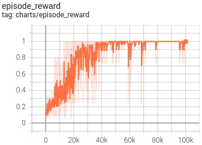
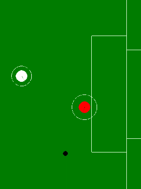
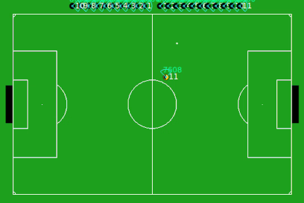

Although I have implemented the algorithm to the best of my knowledge, the correctness of the implementation remains to be checked. Any suggestions are welcome!

# hybrid-sac
[cleanRL](https://github.com/vwxyzjn/cleanrl)-style single-file pytorch implementation of hybrid-SAC algorithm from the paper [Discrete and Continuous Action Representation for Practical RL in Video Games](https://arxiv.org/pdf/1912.11077.pdf)

Hybrid-SAC gives systematic modelling of hybrid action spaces (where both discrete and continuous actions are present). For example, the agent might choose from high-level discrete actions (e.g. move, jump, fire), each of these being associated with continuous parameters (e.g. target coordinates for the move action, direction for the jump action,aiming angle for the fire action).

## Dependencies
* Requirements for training are same as cleanRL(v0.4.0). So `pip install cleanrl` will do.
* Environments:
  - [Platform](https://github.com/cycraig/gym-platform): `pip install -e git+https://github.com/cycraig/gym-platform#egg=gym_platform`
  - [Goal](https://github.com/cycraig/gym-goal): `pip install -e git+https://github.com/cycraig/gym-goal#egg=gym_goal`
  - [Soccer](https://github.com/cycraig/gym-soccer): `pip install -e git+https://github.com/cycraig/gym-soccer#egg=gym_soccer`

Inspired by cleanRL, this repo gives the single-file implementation of the algorithm. Hence, some funcitonalities (like multi-actor execution) are not possible. Although the training is not as efficient as it could be, it is helpful for understanding the algorithm.

The paper experiments the with the following three environments:

## Platform
* Task: To avoid enemies and travel across the platfroms to reach a goal. Episode ends if the agent touches an enemy or falls into a gap between platforms.
* Observations: 9-dimensional vector containing positions and velocities of the player and the enemies along with the features of the platforms.
* Actions: 3 discrete actions, each associated with 1D continuous component.
  - run(dx)
  - hop(dx)
  - leap(dx)
* Reward: Based on the distance travelled.
* To train the agent,
```bash
python hybrid_sac_platform.py --seed 7 --gym-id Platform-v0 --total-timesteps 100000 --learning-starts 1000
```
* After training for 100k steps (~14k episodes), the agent learns to travel till the end:

| ||
| :---: | :---: |
|Behavior of trained agent|Max reward is 1.0|

## Goal
* Task: Kick a ball past the keeper. Episode ends if the ball enters the goals, is captured by the keeper, or leaves the play area.
* Observations: 17-dimensional vector containing positions, velocities, etc of the player, the ball and the goalie.
* Actions:3 discrete actions, each associated with 2D, 1D and 1D continuous components respectively.
  - kick-to(x, y)
  - shoot-goal-left(y)
  - shoot-goal-right(y)
* Reward: 50 for goal, `-distance(ball, goal)` otherwise.
* To train the agent,
```bash
python hybrid_sac_goal.py --seed 2 --gym-id Goal-v0 --total-timesteps 100000 --learning-starts 257
```
* After training for 100k steps, the agent roughly learns a policy to score a goal:

|||
| :---: | :---: |
|Behavior of trained agent|Probability of scoring a goal|
* This agent achives `p_goal` of ~0.25, whereas the paper achieves ~0.73. Thus, more training or tuning is required to improve the performance.

## Soccer
* Task: Score a goal. Episode ends if the ball leaves the play area or enters the goal area.
* Observations: 59-dimensional vector containing relative positions and velocities of the player and the ball.
* Actions: 3 discrete actions, each associated with 2D, 1D and 2D continuous components respectively.
  - dash(power, angle)
  - turn(angle)
  - kick(power, angle)
* Reward: Informative reward which guides the player to reach the ball and kick the ball towards the goal.
* To train the agent,
```bash
python hybrid_sac_soccer.py --seed 2 --gym-id SoccerScoreGoal-v0 --total-timesteps 2000000 --learning-starts 257 --buffer-size 200000 --policy-lr 3e-4 --q-lr 1e-4 --batch-size 32
```
* After training for 2M steps, the agent learns to approach the ball and kick it towards the goal:

|||
| :---: | :---: |
|Behavior of trained agent|Probability of scoring a goal|
* The paper achieves `p_goal` of ~0.6. More tuning is required to improve the performance.

## TODOs
- [x] Train soccer environment
- [ ] Hyperparameter tuning
- [ ] Refactoring
- [ ] Center-align the tables
- [ ] Add proper inference code to run the trained agent

## References
* [This](https://github.com/p-christ/Deep-Reinforcement-Learning-Algorithms-with-PyTorch/blob/master/agents/actor_critic_agents/SAC_Discrete.py) SAC-discrete implementation served as a guide in the process.
* Wrappers for the environments are taken from [MP-DQN](https://github.com/cycraig/MP-DQN).
